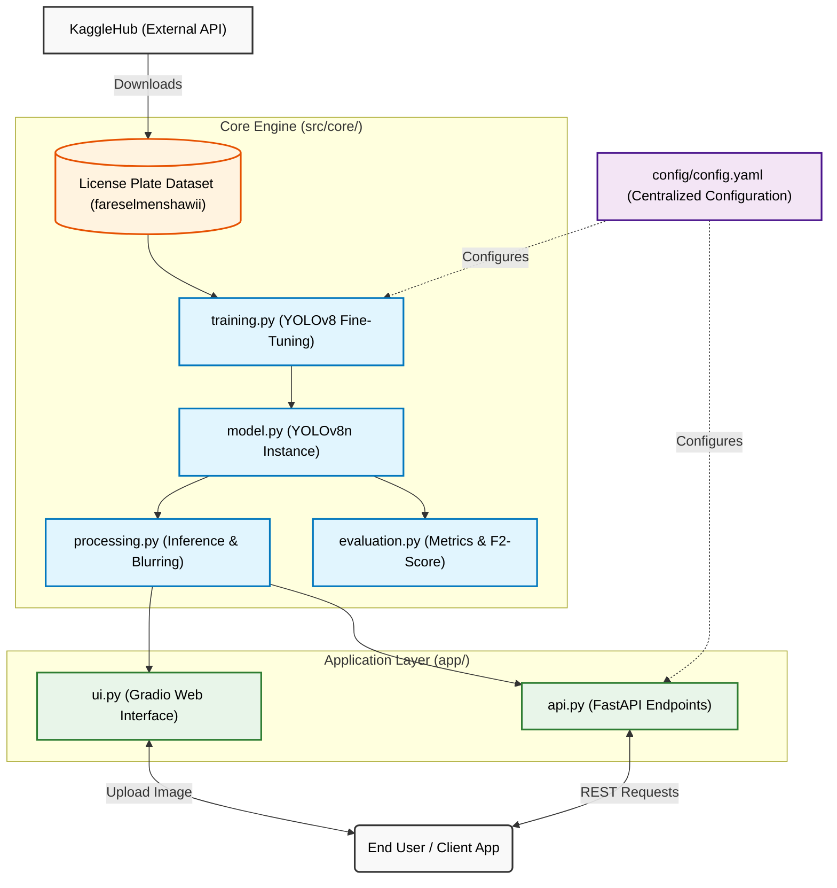
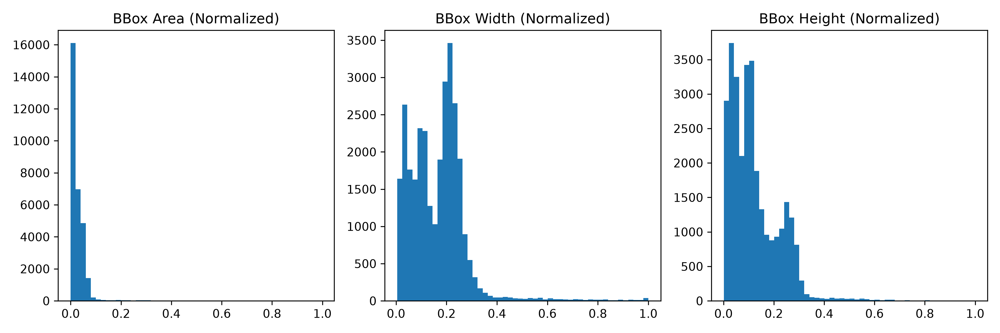
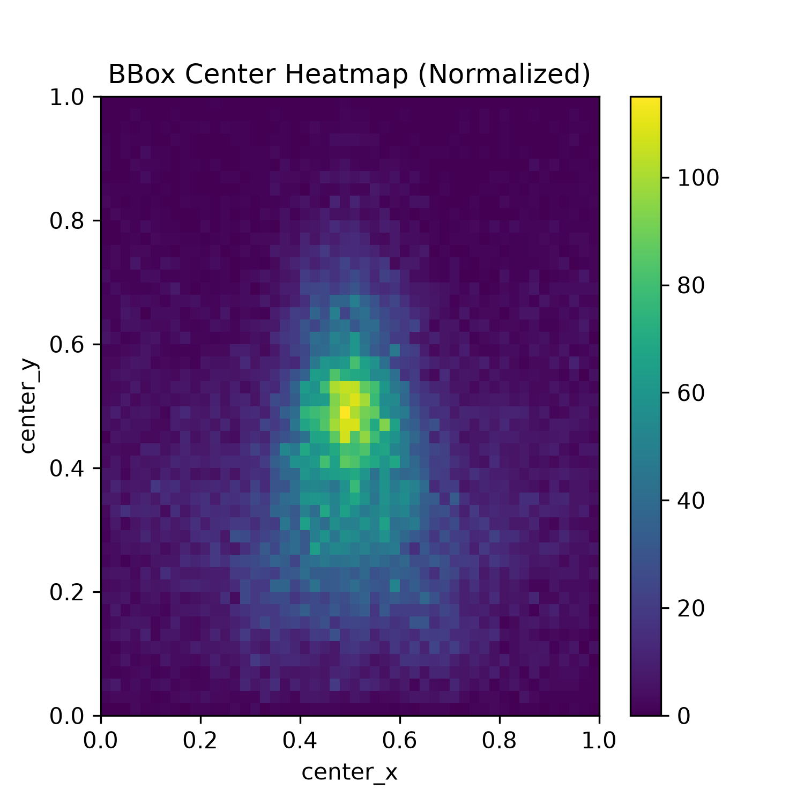
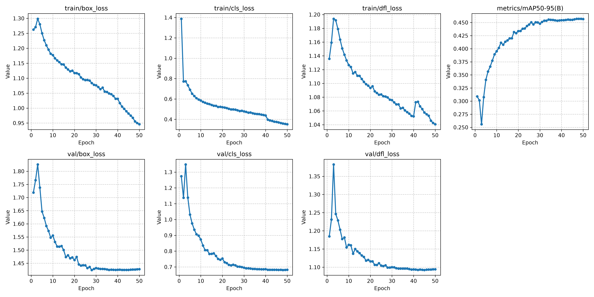
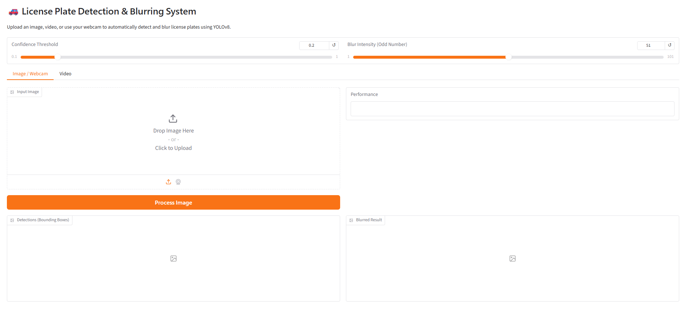
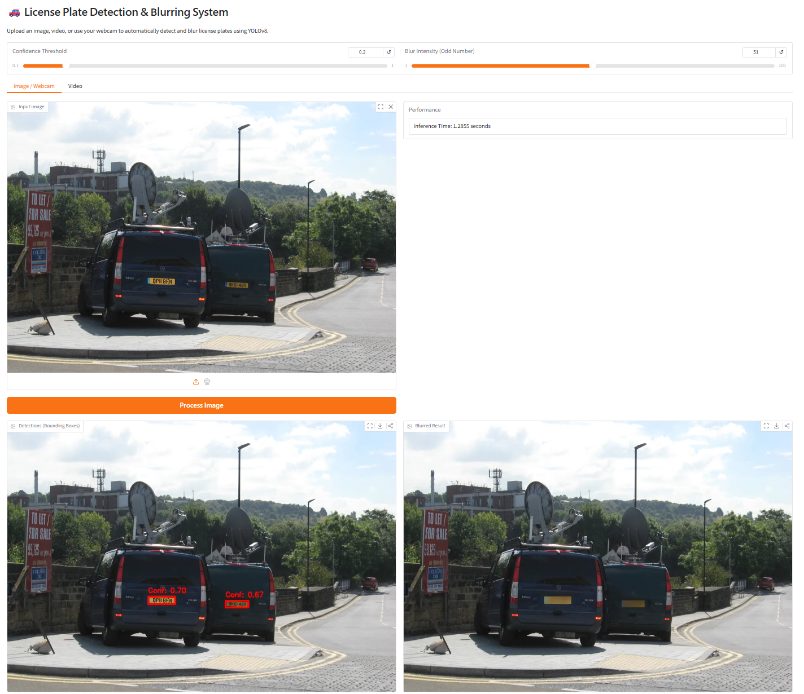

# License Plate Detection & Blurring using YOLOv8

## Table of Contents
- [Problem Statement & Business Context](#problem-statement--business-context)
- [Architecture & Data Ingestion](#architecture--data-ingestion)
- [Prerequisites](#prerequisites)
- [1. Data Exploration and Audit](#1-data-exploration-and-audit)
- [2. YOLOv8 Training Pipeline Setup](#2-yolov8-training-pipeline-setup)
- [3. Evaluate Model Performance](#3-evaluate-model-performance)
- [4. Optimizing Confidence Threshold](#4-optimizing-confidence-threshold)
- [5. Interactive Web Interface (Gradio)](#5-interactive-web-interface-gradio)
- [Summary of Quick Commands](#summary-of-quick-commands)

## Problem Statement & Business Context

With the growing use of cameras in traffic monitoring and surveillance, capturing vehicle images often leads to exposure of sensitive information such as license plate numbers. This raises serious privacy and data protection concerns. The objective of this project is to build an automated system using YOLOv8 to accurately detect vehicle license plates in images or video streams and blur them in real time, ensuring privacy preservation while maintaining the usefulness of the visual data for analysis and monitoring purposes.

### Why YOLOv8?
We chose YOLO (Specifically YOLOv8n) instead of two-stage detectors (like Faster R-CNN) for the following advantages:
- **Real-time Inference Capability**: Crucial for processing video streams without lag.
- **High Accuracy on Small Objects**: Effective for detecting small targets like license plates in a wide field of view.
- **Efficiency & Speed**: YOLOv8 is lighter and faster than traditional two-stage models, reducing computational overhead.
- **Easy Integration**: Built-in validation, augmentation, tracking, and easy export (to TensorRT/ONNX) provided natively via the Ultralytics ecosystem.
- **Maximum Speed**: The nano variant (`yolov8n`) provides the absolute fastest inference speeds while still capturing sufficient detail for license plate detection, making it perfectly suited for real-time edge processing or quick iterations.

## Architecture & Data Ingestion

Below is the high-level architecture diagram illustrating the data flow, core engine components, and application layer. GitHub will automatically render this diagram directly in the browser!



Unlike traditional setups that rely on local datasets, this project leverages `kagglehub` to seamlessly and dynamically download the `fareselmenshawii/large-license-plate-dataset` dataset. This ensures reproducible environments and easy synchronization across different machines.

- **`src/core/`**: Core machine learning engine handling model loading, inference, image processing, and training.
- **`src/utils/`**: Utilities for dataset management (KaggleHub integration) and data visualization.
- **`app/`**: Application layer exposing functionality via a modern Gradio web UI and programmatic FastAPI endpoints.
- **`config/`**: Centralized configuration management using `config.yaml`.

## Prerequisites

- Python 3.10+
- `uv` (fast Python package and project manager)

**Installation:**
```bash
pip install uv
uv sync
```

---

## 1. Data Exploration and Audit

Before training, we must verify the integrity of the dataset and understand its distribution. The data exploration step performs dataset file checks, label numeric validation, and dataset-level Exploratory Data Analysis (EDA).

**How to explore:**
```bash
uv run python -m src.cli --explore-data
```

### Dataset-level EDA

By plotting bounding box statistics, we can understand the distribution of plate sizes and locations within the frame.


The area histogram shows that a high number of bounding boxes are concentrated at extremely small values, meaning many plates are tiny.


The center heatmap shows where plates typically appear in frames, which is highly useful for defining augmentation or anchor settings.

### Visual Sanity Check

A visual sanity check overlays the bounding boxes onto sample images from the training dataset.


This confirms that the dataset labels correctly map to the license plates in the images.

---

## 2. YOLOv8 Training Pipeline Setup

We use Ultralytics' YOLOv8 implementation to train a model that detects license plates. The pipeline automatically pulls the dataset via `kagglehub`, creates the necessary YAML configuration, and fine-tunes the model.

**How to train:**
```bash
uv run python -m src.cli --train
```

After training completes, training metrics are generated to visualize the model's convergence and accuracy.


Downward trending loss metrics indicate the model is successfully learning to locate plates, while upward trending mAP indicates the model is becoming more accurate at predicting unseen validation samples

---

## 3. Evaluate Model Performance

To verify that the model works well in real-world scenarios, we evaluate its accuracy against the unseen test dataset.

**How to evaluate:**
```bash
uv run python -m src.cli --evaluate
```

This step calculates explicit bounding box Mean Absolute Error (MAE), Average Intersection over Union (IoU), and standard mAP metrics. It also generates random evaluation samples showing the original image, bounding box prediction, and blurred output.


High-quality predictions ensure that the license plates are effectively detected and properly anonymized by the blurring filter.

---

## 4. Optimizing Confidence Threshold

Since missing a license plate (False Negative) is highly costly in terms of privacy compliance, we calculate the mathematically optimal confidence threshold using the **F2-Score** (which heavily favors recall over precision).

**How to optimize:**
```bash
uv run python -m src.cli --optimize-threshold
```

**Optimization Output:**
```text
--------------------------------------------------
CUSTOM EVALUATION METRICS (Bounding Box)
Precision @ 0.20: 0.8529
Recall    @ 0.20: 0.8945
F2-Score  @ 0.20: 0.8859
Average IoU: 0.7404
Mean Absolute Error (normalized cx,cy,w,h): 0.0033

uv run python -m src.cli --optimize-threshold
Downloading dataset 'fareselmenshawii/large-license-plate-dataset'...
Dataset downloaded to /home/skdey/.cache/kagglehub/datasets/fareselmenshawii/large-license-plate-dataset/versions/1
Created configuration file at derived/dataset.yaml
Loading trained model from models/best_license_plate_yolov8.pt...
Running baseline inference to collect all potential predictions...

Sweeping confidence thresholds to optimize F2-Score...
Threshold  | Precision  | Recall     | F2-Score
--------------------------------------------------
0.05       | 0.5844     | 0.9199     | 0.8252
0.10       | 0.7027     | 0.9141     | 0.8622
0.15       | 0.7908     | 0.9082     | 0.8820
0.20       | 0.8529     | 0.8945     | 0.8859
0.25       | 0.8946     | 0.8789     | 0.8820
0.30       | 0.9145     | 0.8770     | 0.8842
0.35       | 0.9287     | 0.8652     | 0.8772
0.40       | 0.9416     | 0.8496     | 0.8665
0.45       | 0.9469     | 0.8359     | 0.8560
0.50       | 0.9569     | 0.8242     | 0.8477
0.55       | 0.9629     | 0.8105     | 0.8370
0.60       | 0.9705     | 0.7715     | 0.8045
0.65       | 0.9889     | 0.6953     | 0.7392
0.70       | 0.9892     | 0.5352     | 0.5892
0.75       | 0.9826     | 0.2207     | 0.2612
0.80       | 1.0000     | 0.0547     | 0.0674
0.85       | 1.0000     | 0.0020     | 0.0024
0.90       | 1.0000     | 0.0020     | 0.0024
0.95       | 0.0000     | 0.0000     | 0.0000
--------------------------------------------------
Optimal Threshold (Highest F2-Score): 0.20
Successfully updated 'inference.conf_threshold' in config/config.yaml to 0.20
```

---

## 5. Interactive Web Interface (Gradio)

To demonstrate the real-time license plate detection and blurring capabilities, this project includes an interactive Gradio web application.

**How to launch:**
```bash
uv run python -m src.cli --ui
```

The app provides an intuitive interface where users can upload an image or use their webcam to test the model dynamically. It features real-time control over the inference confidence threshold and the blur intensity. 


*The default interface allows for drag-and-drop image uploads.*


*When tested on a sample image, the app instantly highlights the predicted bounding box and returns the fully anonymized image alongside processing metrics.*

---

## Summary of Quick Commands

Below is a summary of the unified CLI commands to run the various functionalities of this project:

- **Explore Data & EDA**: `uv run python -m src.cli --explore-data`
- **Train Model**: `uv run python -m src.cli --train`
- **Evaluate Model**: `uv run python -m src.cli --evaluate`
- **Optimize Confidence Threshold**: `uv run python -m src.cli --optimize-threshold`
- **Run Automated Tests**: `uv run pytest tests/`
- **Launch Web UI (Gradio)**: `uv run python -m src.cli --ui`
- **Launch API (FastAPI)**: `uv run python -m src.cli --api`
